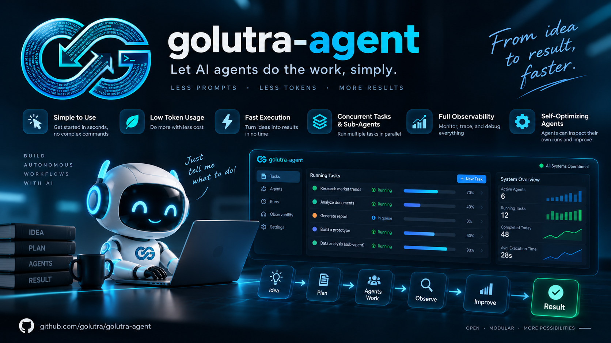

<div align="center">
  
  <h1>Golutra Agent</h1>
  <p><strong>Simple coding agent. Reliable background work. Full observability.</strong></p>

  <p>
    <a href="https://github.com/golutra/golutra-agent/actions/workflows/ci.yml"></a>
    <a href="https://github.com/golutra/golutra-agent/releases"></a>
    <a href="https://github.com/golutra/golutra-agent/blob/main/LICENSE"></a>
    <a href="https://www.rust-lang.org/"></a>
  </p>

  <p>
    <a href="README.md">English</a> ·
    <a href="README_CN.md">中文</a> ·
    <a href="docs/README.md">Docs</a> ·
    <a href="CONTRIBUTING.md">Contributing</a> ·
    <a href="SECURITY.md">Security</a> ·
    <a href="NOTICE">Notice</a> ·
    <a href="https://github.com/golutra/golutra-agent/releases">Releases</a>
  </p>
</div>

<p align="center">
  
</p>

Golutra Agent is a simple, local-first coding agent for moving from intent to
working code. Install it, run `golutra`, and describe the result you want; the
agent inspects the current workspace, changes files, runs checks, and reports
what actually happened. You do not need to learn a command catalog before
getting useful work done.

It keeps the path simple for people and the context focused for models: state
the goal once, let the agent choose the necessary actions, and receive a clear
result backed by real workspace evidence.

The everyday path is deliberately short:

- **Two primary entry points:** `golutra` opens the interactive TUI; `golutra exec`
  is the headless path for scripts and CI.
- **Less repeated context:** the default coding profile exposes a compact tool
  surface, bounded context, and stable provider prefixes, reducing unnecessary
  round trips so the model can spend its budget on the task.
- **Work that keeps running:** background shell sessions and independent
  sessions can continue in parallel, subject to the host's resource and policy
  limits; a single session still keeps an ordered task lane.
- **Observable without clutter:** the normal UI shows progress and results;
  explicit debug, JSON, and run-bundle surfaces expose the detailed events,
  token usage, tool outcomes, and verification facts when they are needed.
- **Model-led execution:** the agent can inspect real turn, background-process,
  checkpoint, and verification state, then choose and adapt its next action.
  Runtime safeguards preserve failures and never invent a successful result or
  skip a necessary check.

Under that simple surface, Golutra provides a durable typed execution loop. An
LLM generates tokens; Golutra turns them into `RuntimeEvent` facts, routes them
through an explicit `ModelInputEnvelope`, and determines completion from a
`VerificationRecord` rather than the model's own claim. The same facts can drive
the UI, debugging, replay, evaluation, and controlled improvement without
polluting the conversation with internal governance data.

> Status: `0.2.0` is an early, actively evolving release. Runtime and protocol
> APIs may change before a stable compatibility policy is published.

## English

### Why Golutra

A capable model is only one part of a useful coding agent. Golutra pairs an
open-ended model with a small, dependable execution loop so users get the
speed of a conversation without giving up evidence, recovery, or control.

The result is a focused workflow:

- **Say what you want:** the model owns planning and tool choice instead of
  forcing users through a command checklist.
- **Spend tokens on the task:** compact tools, bounded context, and stable
  prefixes reduce repeated input while preserving the model's reasoning.
- **Keep work moving:** background processes and independent sessions can run
  alongside the interactive task, with explicit lifecycle and cancellation.
- **Know what happened:** progress stays readable, while detailed token usage,
  tool outcomes, events, and verification facts remain available on demand.
- **Finish on evidence:** files, commands, checks, and failures are recorded so
  a completed task means more than a confident final sentence.

### Runtime Model

```text
User input
  -> Session Command Protocol
  -> RuntimeEvent ledger + StateProjection
  -> Runtime OS control loop
  -> ModelInputEnvelope
  -> Provider / Tool loop
  -> VerificationRecord + LoopDecision
  -> User / Debug / Context-audit / Evaluation projections
```

This flow is split into three planes with different responsibilities:

| Plane | Responsibility |
| --- | --- |
| Runtime control | Owns sessions, lanes, turns, tools, verification, budgets, and terminal state. |
| Model boundary | Compiles only approved messages and tool definitions into the provider request. |
| Observation and governance | Preserves facts and artifacts, checks trace integrity, and builds purpose-specific projections. |

The separation is a security and correctness boundary, not just a UI choice.
Debug or governance records do not automatically become model context, and a
conversation transcript is only one projection of the durable facts.

### From Evidence to Improvement

Golutra can turn a failed or partial task into a controlled improvement path:

```text
Task execution
  -> RuntimeEvent and evidence
  -> VerificationRecord
  -> durable post-task review
  -> ImprovementCandidate
  -> paired regression
  -> PromotionDecision
```

Candidates carry evidence, risk, verification, and rollback information.
Incomplete traces or missing baseline/candidate pairs stay in review instead
of being treated as a pass. High-risk changes, including runtime code, policy,
sandbox, and compatibility changes, require human review; the normal runtime
cannot publish a new stable runtime by itself.

### Quick Start

#### Everyday use

For the published launcher, Node.js `18` or newer is enough; no Rust toolchain
is required. Install once, then use the same two commands for interactive work
or automation:

```bash
npm install -g @golutra/agent
golutra
golutra exec "inspect this workspace and run the checks"
```

`golutra` with no arguments opens the TUI. Describe the goal in plain language;
the agent decides which reads, edits, commands, and checks are needed. A
background shell session can keep running while the agent continues other work,
and the TUI reports its real state when it finishes. Use `golutra exec` when a
caller needs a non-interactive turn or JSON output:

```bash
golutra exec --json "summarize the current changes"
```

The default interactive `coding` profile keeps the model-facing tool surface
small and the context bounded. Select `--tool-profile full` only when a task
needs low-frequency extensions; this does not change the model's reasoning
settings. Progress and final results stay simple in the normal UI, while
explicit JSON/debug/run-bundle views provide detailed token, tool, event, and
verification facts for troubleshooting or automation.

The TUI can guide first-time provider setup. Non-secret defaults may be kept in
`$GOLUTRA_HOME/runtime.json` (global) or `<workspace>/.golutra/runtime.json`
(project); project values override global values, session controls are in
memory, and explicit `--execution-mode`/`--tool-profile` flags win. Credentials
stay in the owner-only credential store or environment references.

#### Build from source

Source builds require Rust `1.93` or newer. Python `3.11` or newer is needed for
release checks and the Python SDK; Node.js `22` or newer is needed for the
TypeScript SDK.

```bash
git clone https://github.com/golutra/golutra-agent.git
cd golutra-agent
cargo run -p golutra-tui
```

For a one-shot source build or the local app-server:

```bash
cargo run -p golutra-cli -- chat "inspect this workspace"
cargo run -p golutra-cli -- --cwd "$PWD" exec "run the checks"
cargo run -p golutra-app-server -- --addr 127.0.0.1:47831
```

If you pass TUI flags through Cargo, put the separator before the program
arguments:

```bash
cargo run -p golutra-tui -- --yolo
```

`cargo run -p golutra-tui --yolo` is parsed by Cargo itself and fails with
`unexpected argument '--yolo'`.

#### Maintainer package work

The published npm package is a lightweight launcher. npm resolves the matching
native package for the host platform, and installation does not run a network
download script. `golutra-tui` remains available as an explicit TUI alias.

The current release workflow publishes Linux x64/arm64, macOS x64/arm64, and
Windows x64/arm64 native packages. The npm distribution contains the
interactive TUI and scriptable CLI; app-server, trace/observability,
supervisor, and evaluation entry points remain in the platform release archive
below.

Maintainers can build the npm artifacts locally from a release target:

```bash
python3 scripts/package_npm.py --package platform \
  --target aarch64-apple-darwin \
  --binary-dir target/aarch64-apple-darwin/release
python3 scripts/package_npm.py --package root \
  --targets aarch64-apple-darwin
```

Provider setup and credential storage are documented in
[`docs/llm-provider-integration.md`](docs/llm-provider-integration.md).

### Clients and Protocol

All clients use the same command/query/event vocabulary:

```text
TUI / CLI / SDK / remote client
              |
       app-server or embedded host
              |
       RuntimeHost + AgentHarness
        /       |        \
   provider   tools    durable store
              |
       typed events, traces, and verification
```

Useful entry points:

| Surface | Start here |
| --- | --- |
| Interactive terminal | `cargo run -p golutra-tui` |
| Scriptable CLI | `cargo run -p golutra-cli -- --help` |
| Local/remote service | [`docs/runtime-entrypoints.md`](docs/runtime-entrypoints.md) |
| TUI driver | [`docs/tui-driver.md`](docs/tui-driver.md) |
| Python SDK | [`sdk/python`](sdk/python) |
| TypeScript SDK | [`sdk/typescript`](sdk/typescript) |
| Architecture | [`docs/ARCHITECTURE.md`](docs/ARCHITECTURE.md) |
| Observability and evaluation | [`docs/evaluation-observability.md`](docs/evaluation-observability.md) |
| Improvement loop | [`docs/agent-improvement-loop.md`](docs/agent-improvement-loop.md) |
| Versioned schema | [`schemas/sdk-protocol.schema.json`](schemas/sdk-protocol.schema.json) |

### Build and Verify

The repository keeps generated protocol clients checked in. Run the relevant
checks before opening a pull request:

```bash
just fmt-check
just clippy
just test
just schema
just ts-check
just py-check
just open-source-check
just release-package-smoke
```

Live provider tests and external benchmark runs are opt-in. They are not
required for an ordinary contribution and must never read a contributor's
normal credentials implicitly.

### Release Archives

Build a reproducible archive for the current host:

```bash
python3 scripts/package_release.py --output-dir dist
python3 scripts/package_release.py --verify dist/golutra-agent-v*-*.tar.gz
```

Unix targets produce `.tar.gz`; Windows targets produce `.zip`. Each archive
has a SHA-256 sidecar, an external manifest, and the same manifest inside the
archive. The archive also includes `LICENSE` and `NOTICE` so a binary release
retains its legal notices. Tag releases must match the workspace version and
are built by [`.github/workflows/release.yml`](.github/workflows/release.yml).

### Contributing and Security

Read [`CONTRIBUTING.md`](CONTRIBUTING.md) before submitting a change. Please
use the issue forms for bugs and feature requests, and use
[`SECURITY.md`](SECURITY.md) for vulnerabilities instead of posting sensitive
details in a public issue.

Golutra Agent is distributed under the [Apache License 2.0](LICENSE).
Contributions are accepted under the same license as described in Section 5;
there is no separate CLA requirement in this repository at present. See
[NOTICE](NOTICE) for dependency and README asset notices.
